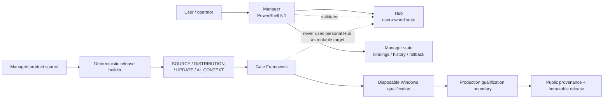
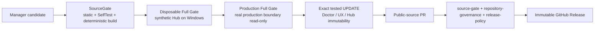
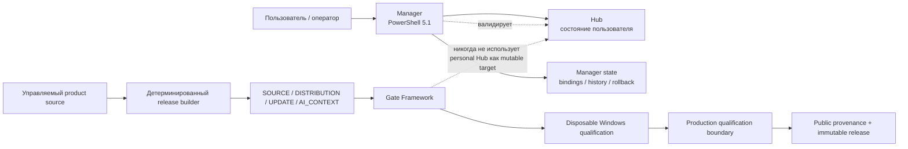

# Keelaryn

[Русская версия ниже](#русская-версия)

Keelaryn is a **Windows-first local automation and state-management platform** built around Windows PowerShell 5.1. It manages a stateful local Hub through transactional updates, integrity validation, migrations, diagnostics, deterministic release artifacts and gated qualification.

The Hub is the real workload. The engineering focus of this repository is the **Manager runtime, failure handling, release system, validation model and trust boundaries** around that workload.

> This repository is intentionally not a public personal knowledge base. Real Hub data, credentials, runtime state and private qualification evidence are excluded from the public tree.

## Problem

Stateful local automation becomes difficult when product code and user-owned data evolve independently. A useful system has to answer more than “does the script run?”:

- How is an update installed without corrupting existing state?
- What happens if installation fails halfway through?
- Can the exact same source produce the same release artifacts twice?
- How is a package rejected before it can escape the intended filesystem boundary?
- How do tests exercise migrations, rollback and UI behavior without mutating production data?
- How is a released artifact tied back to the exact candidate that passed qualification?

Keelaryn treats these as product requirements rather than post-release cleanup tasks.

## What Keelaryn is

| Component | Responsibility |
|---|---|
| **Manager** | Windows PowerShell application for lifecycle operations: diagnostics, updates, rollback, migrations, release construction and validation. |
| **Hub** | Stateful local workload managed by the system. A real Hub is user-owned and never committed to the public repository. |
| **Gate Framework** | Reusable Windows qualification harness that binds tests to candidate identity and exercises disposable update/recovery paths. |
| **Repository governance** | CI/CD, provenance, branch protection, release policy and supply-chain controls around the source/release boundary. |

## Architecture

The central boundary is **product source vs instance-owned state**. `manager/product/install/INSTALLATION.json` defines the managed Manager file set; runtime state and the real Hub live outside that source set.

See [Architecture overview](docs/ARCHITECTURE_OVERVIEW.md) for identity layers, mutation boundaries and the release/gate model.

## Engineering challenges

| Challenge | Implemented approach | Evidence |
|---|---|---|
| Safe in-place Manager updates | staged validation, rollback snapshot, post-install checks and rollback fault injection | [Release engineering](docs/RELEASE_ENGINEERING.md) |
| Reproducible releases | isolated deterministic builds for SOURCE, DISTRIBUTION, UPDATE and AI_CONTEXT | [Public file manifest](PUBLIC_FILE_MANIFEST.json) |
| Stateful integrity | instance/checkpoint identity, portable-content validation and Doctor diagnostics | [Architecture](docs/ARCHITECTURE_OVERVIEW.md) |
| Hostile/corrupt filesystem inputs | traversal, reserved-name, case/Unicode collision and reparse-point defenses | [Security model](docs/SECURITY_MODEL.md) |
| Test isolation | disposable Hub/update targets; production Hub is never a mutable qualification target | [Engineering case study](docs/ENGINEERING_CASE_STUDY.md) |
| Windows-specific behavior | PowerShell 5.1 compatibility, filesystem semantics, file-lock diagnostics and retry controls | [Detailed Manager docs](manager/product/docs/) |
| AI context cost | generated task-routed AI_CONTEXT bound to exact managed runtime/source identity | [Engineering case study](docs/ENGINEERING_CASE_STUDY.md) |
| Remote development | GitHub-hosted Windows disposable Full Gate with synthetic Hub and explicit non-production evidence semantics | [Remote qualification](docs/REMOTE_QUALIFICATION.md) |
| Supply-chain identity | SHA-pinned Actions, read-only default token, required checks and immutable-release policy | [Repository governance](docs/REPOSITORY_GOVERNANCE.md) |

## Release and qualification pipeline

Disposable qualification is deliberately classified as **prequalification**, not production approval. Final release evidence still requires the applicable real production boundary checks.

## Evidence

Current identities are intentionally **not duplicated in prose**. They are available from machine-readable or immutable sources:

- [Latest GitHub Release](https://github.com/efremov-aleksei-96/keelaryn/releases/latest) — published install/update assets and release immutability.
- [`PUBLIC_PROVENANCE.json`](PUBLIC_PROVENANCE.json) — current Manager identity, framework identity and production qualification facts.
- [`PUBLIC_FILE_MANIFEST.json`](PUBLIC_FILE_MANIFEST.json) — deterministic hashes for authoritative Manager and Gate Framework source sets.
- [`REPOSITORY_GOVERNANCE.json`](REPOSITORY_GOVERNANCE.json) — required checks, merge policy, Actions supply-chain policy and release policy.
- [`tests/framework/manager-gate/`](tests/framework/manager-gate/) — reusable Windows gate source.
- [Remote qualification](docs/REMOTE_QUALIFICATION.md) — synthetic/disposable evidence semantics and security boundary.

## Interesting failure modes and lessons

The project deliberately preserves negative engineering lessons rather than presenting only successful releases:

- isolated build roots exposed release nondeterminism that a same-root rebuild could hide;
- an issued AI_CONTEXT candidate was rejected and corrected in a new Manager version instead of silently replacing candidate bytes;
- update qualification includes injected failure and rollback verification, not only the happy path;
- ZIP/filesystem validation treats Windows path rules, traversal, collisions and reparse points as part of the input contract;
- test infrastructure is itself a trust boundary, so reusable gate changes are qualified separately from Manager product changes.

The detailed stories and supporting repository history are in [Engineering case study](docs/ENGINEERING_CASE_STUDY.md).

## Reliability and security model

Keelaryn is designed for a trusted local operator, not as a sandbox for arbitrary hostile code. It fails closed around the boundaries that can damage local state or invalidate release evidence:

- exact managed-file identity;
- fresh validation at transaction/commit boundaries;
- rollback snapshots and post-update validation;
- package/ZIP path and filesystem safety checks;
- read-only production paths during qualification;
- explicit provenance for candidate, gate and release identity;
- personal Hub/runtime/private evidence excluded from public artifacts.

See [Security model](docs/SECURITY_MODEL.md).

## Technology

- Windows PowerShell 5.1 and .NET Framework APIs
- Windows filesystem/process integration and Restart Manager diagnostics
- JSON manifests and explicit schemas
- SHA-256 content identity
- ZIP packaging and defensive extraction/inspection
- Git and GitHub Actions on pinned OS-family runners
- deterministic release construction and artifact roundtrip validation
- Mermaid/Markdown documentation for architecture and operational flows

## Explore the repository

**20 seconds:** read this page and the architecture diagram above.

**About 1 minute:** open [Architecture overview](docs/ARCHITECTURE_OVERVIEW.md) and [Engineering case study](docs/ENGINEERING_CASE_STUDY.md).

**About 3–5 minutes:** inspect [Release engineering](docs/RELEASE_ENGINEERING.md), [Security model](docs/SECURITY_MODEL.md), [`PUBLIC_PROVENANCE.json`](PUBLIC_PROVENANCE.json) and the [latest release](https://github.com/efremov-aleksei-96/keelaryn/releases/latest).

For interview-oriented interpretation, see [Portfolio notes](PORTFOLIO.md).

## Try it on Windows

Use the packaged release rather than the repository source ZIP:

1. Open [Releases](https://github.com/efremov-aleksei-96/keelaryn/releases/latest).
2. Download `Keelaryn_v<version>_Windows.zip`.
3. Extract it to a normal writable folder.
4. Run `Keelaryn.cmd` inside the extracted `keelaryn` folder.
5. On a clean installation, create or connect a Hub and run **Doctor**.

Requirements: Windows 10/11 or Windows Server with **Windows PowerShell 5.1**.

See [Getting Started](GETTING_STARTED.md) for the complete onboarding path.

## Public repository boundary

The public tree includes product source, generic Hub governance/starter material and reusable qualification tooling. It excludes:

- `manager/state/**` runtime data;
- a real personal `hub/**`;
- private `tests/work/**` and `tests/results/**` evidence;
- CURRENT/CANDIDATE/APPROVED transports and generated release ZIPs;
- bindings, credentials, private keys and recovery material.

## License

Keelaryn is released under the [MIT License](LICENSE). The license covers public repository source and documentation, not uncommitted personal Hub/runtime data.

---

# Русская версия

Keelaryn — это **локальная Windows-first платформа автоматизации и управления состоянием**, построенная вокруг Windows PowerShell 5.1. Она управляет stateful Hub через транзакционные обновления, проверку целостности, миграции, диагностику, детерминированные release-артефакты и обязательную квалификацию через gates.

Hub — реальная рабочая нагрузка системы. Основной инженерный фокус этого репозитория — **Manager runtime, обработка отказов, release system, модель валидации и trust boundaries**, окружающие эту нагрузку.

> Этот репозиторий намеренно не является публичной персональной базой знаний. Реальные данные Hub, учётные данные, runtime state и приватные qualification evidence исключены из публичного дерева.

## Проблема

Stateful локальная автоматизация становится сложной, когда код продукта и данные, принадлежащие пользователю, развиваются независимо. Полезная система должна отвечать не только на вопрос «запускается ли скрипт?»:

- Как установить обновление, не повредив существующее состояние?
- Что произойдёт, если установка завершится ошибкой посередине?
- Может ли один и тот же исходный код дважды породить идентичные release-артефакты?
- Как отклонить пакет до того, как он сможет выйти за допустимую границу файловой системы?
- Как тестировать миграции, rollback и UI, не изменяя production data?
- Как связать опубликованный артефакт именно с тем candidate, который реально прошёл qualification?

Keelaryn рассматривает эти вопросы как требования к продукту, а не как задачи по уборке после релиза.

## Что такое Keelaryn

| Компонент | Ответственность |
|---|---|
| **Manager** | Windows PowerShell-приложение для lifecycle-операций: диагностики, обновлений, rollback, миграций, сборки release и валидации. |
| **Hub** | Stateful локальная рабочая нагрузка под управлением системы. Реальный Hub принадлежит пользователю и никогда не коммитится в публичный репозиторий. |
| **Gate Framework** | Переиспользуемый Windows qualification harness, который связывает тесты с identity candidate и проверяет disposable update/recovery paths. |
| **Repository governance** | CI/CD, provenance, защита веток, release policy и supply-chain controls на границе source/release. |

## Архитектура

Центральная граница системы — **product source vs instance-owned state**. `manager/product/install/INSTALLATION.json` определяет управляемый набор файлов Manager; runtime state и реальный Hub находятся вне этого source set.

См. [Architecture overview](docs/ARCHITECTURE_OVERVIEW.md) для identity layers, mutation boundaries и модели release/gate.

## Инженерные задачи

| Задача | Реализованный подход | Доказательство |
|---|---|---|
| Безопасные in-place обновления Manager | staged validation, rollback snapshot, post-install checks и rollback fault injection | [Release engineering](docs/RELEASE_ENGINEERING.md) |
| Воспроизводимые релизы | изолированные детерминированные сборки SOURCE, DISTRIBUTION, UPDATE и AI_CONTEXT | [Public file manifest](PUBLIC_FILE_MANIFEST.json) |
| Целостность stateful-системы | identity instance/checkpoint, portable-content validation и Doctor diagnostics | [Architecture](docs/ARCHITECTURE_OVERVIEW.md) |
| Враждебные/повреждённые filesystem inputs | защита от traversal, reserved names, case/Unicode collisions и reparse points | [Security model](docs/SECURITY_MODEL.md) |
| Изоляция тестов | disposable Hub/update targets; production Hub никогда не является mutable qualification target | [Engineering case study](docs/ENGINEERING_CASE_STUDY.md) |
| Windows-specific поведение | совместимость с PowerShell 5.1, filesystem semantics, диагностика file locks и retry controls | [Detailed Manager docs](manager/product/docs/) |
| Стоимость AI context | task-routed AI_CONTEXT, связанный с точной identity управляемого runtime/source | [Engineering case study](docs/ENGINEERING_CASE_STUDY.md) |
| Удалённая разработка | GitHub-hosted Windows disposable Full Gate с synthetic Hub и явной non-production evidence semantics | [Remote qualification](docs/REMOTE_QUALIFICATION.md) |
| Supply-chain identity | SHA-pinned Actions, read-only token по умолчанию, required checks и immutable-release policy | [Repository governance](docs/REPOSITORY_GOVERNANCE.md) |

## Pipeline релиза и квалификации

Disposable qualification намеренно классифицируется как **prequalification**, а не production approval. Финальная release evidence всё равно требует применимых проверок на реальной production boundary.

## Доказательства

Текущие identity намеренно **не дублируются в описательном тексте**. Они доступны из machine-readable или immutable источников:

- [Latest GitHub Release](https://github.com/efremov-aleksei-96/keelaryn/releases/latest) — опубликованные install/update assets и immutability релиза.
- [`PUBLIC_PROVENANCE.json`](PUBLIC_PROVENANCE.json) — текущая identity Manager, Framework и факты production qualification.
- [`PUBLIC_FILE_MANIFEST.json`](PUBLIC_FILE_MANIFEST.json) — детерминированные хэши authoritative source sets Manager и Gate Framework.
- [`REPOSITORY_GOVERNANCE.json`](REPOSITORY_GOVERNANCE.json) — required checks, merge policy, Actions supply-chain policy и release policy.
- [`tests/framework/manager-gate/`](tests/framework/manager-gate/) — переиспользуемый исходный код Windows gate.
- [Remote qualification](docs/REMOTE_QUALIFICATION.md) — semantics synthetic/disposable evidence и security boundary.

## Интересные failure modes и выводы

Проект намеренно сохраняет отрицательные инженерные уроки, а не показывает только успешные релизы:

- изолированные build roots обнаружили release nondeterminism, который rebuild в том же каталоге мог скрыть;
- выданный AI_CONTEXT candidate был отклонён и исправлен в новой версии Manager, а не тихо заменён новыми bytes;
- update qualification включает injected failure и проверку rollback, а не только happy path;
- ZIP/filesystem validation рассматривает Windows path rules, traversal, collisions и reparse points как часть input contract;
- test infrastructure сама является trust boundary, поэтому переиспользуемые изменения Gate Framework квалифицируются отдельно от Manager product changes.

Подробные истории и подтверждающая история репозитория находятся в [Engineering case study](docs/ENGINEERING_CASE_STUDY.md).

## Модель надёжности и безопасности

Keelaryn рассчитан на доверенного локального оператора, а не на роль sandbox для произвольного враждебного кода. Система работает fail-closed на границах, где ошибка может повредить локальное состояние или сделать release evidence недействительным:

- точная identity managed files;
- свежая валидация на transaction/commit boundaries;
- rollback snapshots и post-update validation;
- проверки package/ZIP paths и filesystem safety;
- read-only production paths во время qualification;
- явная provenance для identity candidate, gate и release;
- personal Hub/runtime/private evidence исключаются из публичных артефактов.

См. [Security model](docs/SECURITY_MODEL.md).

## Технологии

- Windows PowerShell 5.1 и .NET Framework APIs
- интеграция с Windows filesystem/process и диагностика Restart Manager
- JSON manifests и явные schemas
- SHA-256 content identity
- ZIP packaging и defensive extraction/inspection
- Git и GitHub Actions на pinned OS-family runners
- детерминированная сборка релизов и artifact roundtrip validation
- Mermaid/Markdown-документация архитектуры и operational flows

## Как изучить репозиторий

**20 секунд:** прочитайте эту страницу и архитектурную диаграмму выше.

**Около 1 минуты:** откройте [Architecture overview](docs/ARCHITECTURE_OVERVIEW.md) и [Engineering case study](docs/ENGINEERING_CASE_STUDY.md).

**Около 3–5 минут:** изучите [Release engineering](docs/RELEASE_ENGINEERING.md), [Security model](docs/SECURITY_MODEL.md), [`PUBLIC_PROVENANCE.json`](PUBLIC_PROVENANCE.json) и [последний релиз](https://github.com/efremov-aleksei-96/keelaryn/releases/latest).

Для интерпретации проекта с точки зрения собеседования см. [Portfolio notes](PORTFOLIO.md).

## Попробовать на Windows

Используйте упакованный release, а не source ZIP репозитория:

1. Откройте [Releases](https://github.com/efremov-aleksei-96/keelaryn/releases/latest).
2. Скачайте `Keelaryn_v<version>_Windows.zip`.
3. Распакуйте его в обычный каталог с правом записи.
4. Запустите `Keelaryn.cmd` внутри распакованного каталога `keelaryn`.
5. На чистой установке создайте или подключите Hub и запустите **Doctor**.

Требования: Windows 10/11 или Windows Server с **Windows PowerShell 5.1**.

Полный onboarding path описан в [Getting Started](GETTING_STARTED.md).

## Граница публичного репозитория

Публичное дерево включает product source, generic Hub governance/starter material и переиспользуемые qualification tools. Оно исключает:

- runtime data `manager/state/**`;
- реальный personal `hub/**`;
- приватные `tests/work/**` и `tests/results/**` evidence;
- CURRENT/CANDIDATE/APPROVED transports и сгенерированные release ZIPs;
- bindings, credentials, private keys и recovery material.

## Лицензия

Keelaryn распространяется под [MIT License](LICENSE). Лицензия распространяется на публичный исходный код и документацию репозитория, но не на незафиксированные personal Hub/runtime data.
