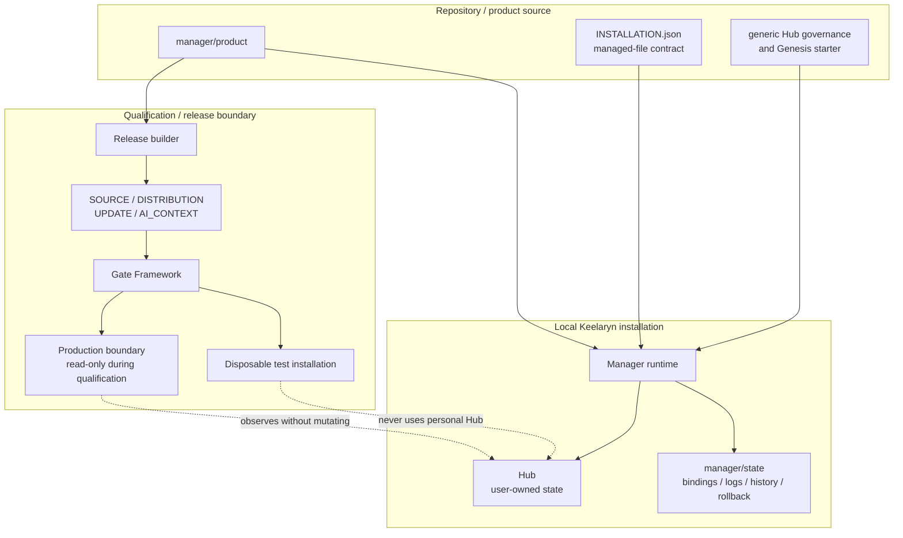
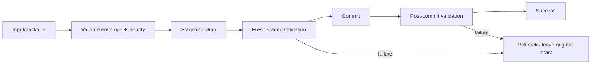

# Architecture overview

Keelaryn separates **generic product source**, **instance-owned state** and **qualification infrastructure**. That separation is the main architectural constraint behind updates, migrations, testing and public distribution.

## System view

## Product / instance boundary

`manager/product/install/INSTALLATION.json` is the canonical Manager managed-file allowlist. The repository's `manager/` source set is validated against that contract.

The following are **instance-owned runtime state**, not product source:

- `manager/state/`;
- the real `hub/`;
- bindings, logs and rollback/history snapshots;
- CURRENT/inbox state;
- generated release output and private qualification evidence.

Generic Hub governance and Genesis starter templates remain product source because Manager must be able to create or migrate an instance without embedding a sample personal Hub.

This separation prevents the public repository, generic distribution and reusable test fixtures from accidentally becoming carriers for personal state.

## Identity layers

Keelaryn uses separate identities for different lifecycle questions:

| Identity | Meaning |
|---|---|
| `instance_id` | Stable identity of one Hub instance. |
| `artifact_id` | Identity of one committed Hub checkpoint. |
| `revision_time_utc` | Immutable human-facing checkpoint time where available. |
| `data_revision` | Internal monotonic lineage/order sequence retained for compatibility. |
| `release_id` | Generic Hub/system product release identity. |
| Manager version | Manager implementation identity, independent from Hub lineage. |
| managed-content digest | Cryptographic identity of the Manager managed source set. |
| gate/framework revision | Qualification implementation identity, separate from Manager bytes. |

Keeping these identities separate avoids treating “same instance”, “same data checkpoint”, “same Manager build” and “same test harness” as interchangeable claims.

## Mutation model

Read-only operations may reuse immutable inspection state within one operation. **Mutation and commit boundaries deliberately revalidate fresh state.**

A typical state-changing path follows this shape:

This is intentionally more conservative than optimizing away repeated checks at the point where state becomes durable.

## Manager update architecture

Manager updates are transactional rather than file-copy upgrades:

1. inspect and validate the update package;
2. stage the candidate managed set;
3. create a rollback snapshot of the installed Manager state required for recovery;
4. validate the staged candidate again at the commit boundary;
5. replace the managed installation;
6. run post-install validation;
7. restore from the rollback snapshot if the transaction fails.

The Full Gate injects update failure to verify the rollback path, then separately performs the native disposable update path.

## Release / gate architecture

Manager release construction produces four primary artifacts plus a manifest:

- SOURCE;
- DISTRIBUTION;
- UPDATE;
- AI_CONTEXT;
- hashes/sizes and release identity in the manifest.

SourceGate uses isolated build roots so deterministic release comparison does not accidentally reuse one workspace. The reusable Gate Framework binds the gate to candidate installation identity and managed-content digest.

The deeper Full Gate then exercises, as applicable:

- rollback fault injection;
- native update from an older baseline;
- Doctor and migration behavior;
- frontend/archive/candidate-transport orchestration;
- CURRENT repair;
- performance controls;
- distribution and Genesis behavior;
- production-path immutability.

The personal production Hub is never a mutable test target.

## Hosted disposable qualification

GitHub-hosted Windows can run a synthetic disposable Full Gate before the maintainer spends a manual production qualification cycle. The hosted runner creates a generic Hub fixture through Genesis and records evidence explicitly classified as **prequalification only**.

See [Remote qualification](REMOTE_QUALIFICATION.md) for the trust boundary and evidence semantics.

## AI_CONTEXT

AI_CONTEXT is generated from managed Manager source and exposes task routes plus exact source/function slices. Its purpose is to reduce model context cost without creating a second implementation or a lossy shadow specification.

The context artifact is therefore tied to exact managed source/runtime identity and validated as part of release qualification.
