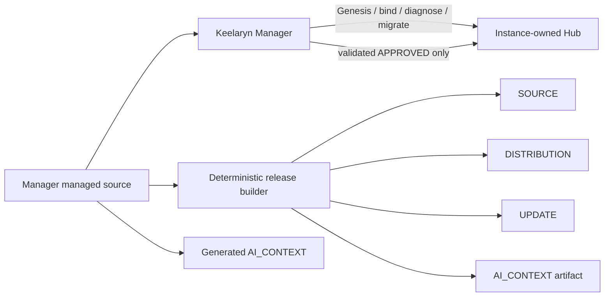

# Architecture overview

## Product / instance separation

The repository contains the Manager product. A Hub is instance-owned state and is deliberately not source code. The product includes only generic governance and starter templates used to create or migrate an instance.

This separation is enforced in several places:

- Manager-only modes are Hub-blind unless binding is explicitly needed.
- Release builders use `_manager_manifest.json`, not directory-wide recursive inclusion.
- CURRENT, inbox, logs, history, binding and release outputs are runtime artifacts.
- Public repository rules ignore `hub/*` except the boundary README.

## Identity layers

Keelaryn distinguishes:

- `instance_id`: stable identity of one Hub instance;
- `artifact_id`: identity of one Hub checkpoint;
- `release_id`: generic product/system release identity;
- Manager version: implementation version, intentionally independent of system release version.

## Validation model

Read-only operations may reuse immutable per-operation inspection snapshots. Transaction and commit boundaries deliberately perform fresh validation. This avoids both duplicate work and stale-cache trust.

Portable Hub analysis hashes each portable file once for a snapshot and derives content, payload and manifest identities from that analysis. ZIP inspection similarly derives multiple identities from one entry-hash pass.

## Update isolation

Manager and Hub updates are separate operations:

- Manager UPDATE packages can change only the managed Manager file set.
- Hub UPDATE installs only validated APPROVED Hub packages.
- `UPDATE_ALL` is an explicit compound operation, not an implicit mixed inbox mode.

## AI_CONTEXT

AI_CONTEXT is a generated development artifact bound to the exact runtime SHA-256. It contains function slices, call/caller maps, task routes and exact managed-source mirrors. It is designed to reduce model context without becoming another implementation of the Manager.
