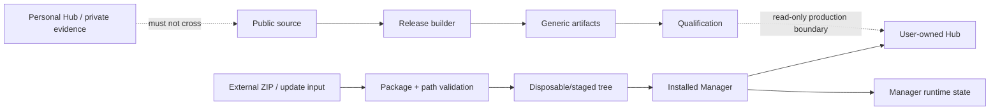

# Security model

Keelaryn is a trusted-user local automation system. It is **not** a sandbox for executing arbitrary hostile code. Its security model focuses on preventing corrupt packages, unsafe filesystem behavior, accidental state destruction and provenance ambiguity from crossing lifecycle boundaries.

## Assets

The main protected assets are:

- the canonical Hub and its checkpoint/instance identity;
- installed Manager managed source/runtime;
- Manager binding, rollback and history state;
- CURRENT and candidate transport identity;
- deterministic release artifacts and manifests;
- qualification evidence and release provenance;
- separation between public generic source and private instance data.

## Trust boundaries

### Package boundary

ZIP/update content is not trusted merely because the archive can be opened. Before interpretation or installation, Keelaryn validates the package envelope, expected structure and destination safety.

### Filesystem boundary

Paths are treated as security-relevant input. Validation covers traversal/escape attempts, Windows reserved names, case/Unicode collisions and reparse points before mutable operations are allowed to continue.

### Product/state boundary

Manager product source is defined by an explicit managed-file contract. Runtime state and the real Hub are not generic product files and must not leak into SOURCE, DISTRIBUTION, UPDATE, AI_CONTEXT or the public repository.

### Qualification boundary

Mutable regression work occurs in disposable test roots. Real production state may be observed read-only where required, but the personal Hub is never a mutable test target.

## Controls

### Integrity and update controls

- SHA-256 identity for packages, managed source and release artifacts;
- exact declared managed-set updates;
- staged package validation before installation;
- fresh validation at mutation/commit boundaries;
- rollback snapshots and post-install validation;
- fault-injection testing of the rollback path.

### Filesystem/package controls

- ZIP traversal and extraction-boundary checks;
- Windows reserved-name rejection;
- case/Unicode collision detection where paths would alias;
- reparse-point rejection at sensitive source/staging/input boundaries;
- bounded file-lock retry;
- read-only Restart Manager diagnostics for lock ownership rather than terminating processes automatically.

### Release and provenance controls

- candidate bytes are immutable once issued for qualification;
- Manager version, gate revision and Gate Framework revision remain distinct identities;
- deterministic isolated release builds;
- exact tested UPDATE identity recorded in public provenance;
- SHA-pinned GitHub Actions under an explicit allowlist;
- read-only default workflow token;
- protected `main` with required checks;
- immutable-release policy and attestation verification for applicable releases.

### Privacy controls

The public source boundary excludes:

- a real Hub;
- Manager runtime state;
- CURRENT/CANDIDATE/APPROVED private transports;
- private test results and local qualification history;
- credentials, private keys, recovery codes and other secret-bearing material.

Generic governance/starter fixtures are sanitized product material, not copies of a personal instance.

## Failure philosophy

Keelaryn generally prefers **fail closed with recoverable state** over guessing:

- ambiguous existing installation state routes to recovery instead of Genesis overwrite;
- invalid or stale package identity stops update processing;
- staged update failure preserves/restores the previous Manager;
- archive/path safety failures abort before extraction escapes the intended root;
- disposable prequalification never upgrades its evidence classification to production approval.

## Security of the test infrastructure

The Gate Framework is part of the release trust boundary. Framework changes are therefore qualified separately rather than being silently mixed with Manager product-byte changes.

Hosted disposable qualification uses a synthetic Hub, a read-only repository token and a fixed qualification pipeline. It is not a general remote PowerShell execution service.

See [Remote qualification](REMOTE_QUALIFICATION.md) and [Repository governance](REPOSITORY_GOVERNANCE.md).

## Non-goals

This model does not claim to defend against:

- an administrator intentionally modifying local product files and bypassing all validation;
- arbitrary malicious code already executing with the same OS user privileges;
- a compromised operating system or PowerShell runtime;
- secret management for credentials that should not be stored in Keelaryn at all.

The project instead aims to make ordinary lifecycle operations, package handling, release publication and testing **deterministic, inspectable and resistant to accidental or malformed-input damage**.

## Reporting / disclosure

Do not attach real Hub data, credentials or private transports to public issues. Use GitHub Private Vulnerability Reporting when available for security-sensitive reports.
